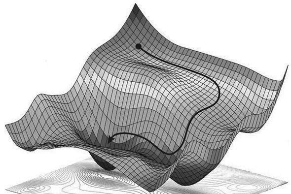
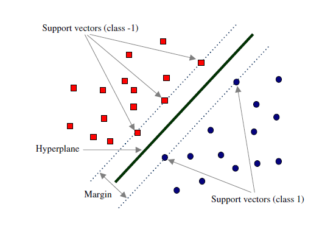
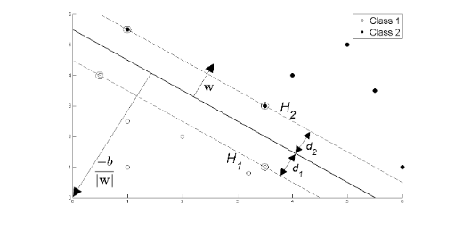
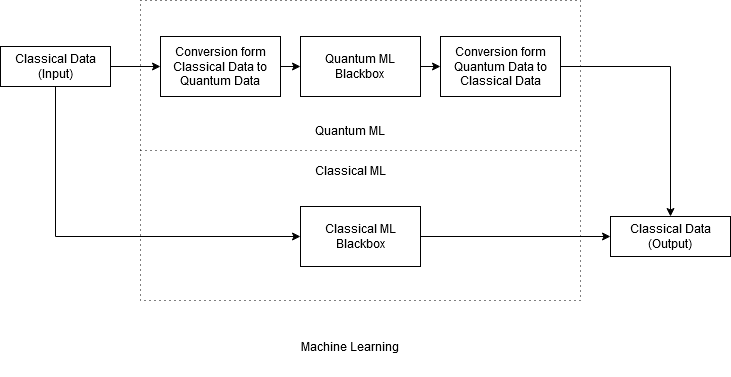

Abstract
========

This paper aims to explore the nuances of Quantum Machine Learning by
discussing the many intricacies involved in the field. The paper begins
by discussing the techniques present in modern day machine learning
practices. It goes over surface level descriptions of Supervised and
Unsupervised learning. The paper further explores two classical machine
learning algorithms - Gradient Descent and Support Vector Machines. The
paper explores the mathematics of support vector machines to build a
basis for the quantum counterpart of the algorithm. The algorithms
perform differently and solve a different class of problems entirely
thus maintaining a diverse discussion within the context of this paper.

The paper then moves on towards exploring the quantum counterparts of
the algorithms explored and discussed before the section. Here the many
techniques of quantum machine learning relevant to these algorithms are
discussed while, however, some technicalities are omitted due to limited
scope of this paper. The paper attempts at informing the generalities
present within quantum machine while also acknowledging the broad and
open ended scope of the field in present day. The paper finally creates
a general description based on the two quantum machine learning
algorithms discussed.

Introduction
============

The data that we observe can be generally explained by an underlying
process. However, the vast amount of data that we observe around us
leaves us benign of any patterns that may emerge from that data. For
instance, we can observe that consumer behaviors are cyclical and their
purchase histories follow a certain trend. To expound, we can see that
people do no buy warm clothes all year round, or consume the same food
all year round. While these trends are easy to observe, humans tend to
miss many trends that machines can easily detect.

Machines are extremely good at crunching data, thus using data to
approximate a certain trend within it makes obseving those trends much
easier. While approximations may not preesent us the complete picture
due to the many irregularities present within the data, we are still
able to infer a certain trend from it. This is where machine learning
comes in. These trends or patterns may help us understand the
correlations within the data and by consequence help us infer a
causation for that trend. This allows us to then predict human behavior,
and other trends in data based on the assumption that these trends are
consistent and are not subject to a lot of change [@BOOK:3].

What is Machine Learning?
-------------------------

*Machine Learning (ML)* is the field of study that involves techniques
that allow machines to learn from large samples of data. Machine
Learning is a broad term that encompasses a wide variety of techniques
to characterize and classify data that then aids us in making decisions
by predicting outcomes of new data. Generally Machine Learning involves
training a machine using a learning algorithm that takes data set as
input outputs a certain classification, ir characterisitic of the data.
Machine learning solutions are currently widespread in the classical
paradigm of computing, and generally rely on classical data
sets.[@inproceedings]

### Learning Methodologies

In terms of learning mathodologies, machine learning is generally
divided into three categories:

-   **Supervised Learning**

    This method involves the use of a data set that is comprised of
    input and corresponding output vectors. A very common dataset of
    this category is used in training machines to recognize handwritten
    digits. Once the machine goes through enoug data, it becomes aware
    of trends within the handwritten data and is then capable of
    recognizing new handwritten data and map it to the right digit.
    [@BOOK:3]

-   **Unupervised Learning**

    This method involves the use of unstructured training data that
    consists of a set of input vectors $x$ without any corresponding
    target values. The goal may be to discover groups of similar
    examples within the data, where it is called *clustering*, or to
    determine the distribution of data within the input space, known as
    *density estimation*, or to project the data from a high-dimensional
    space down to two or three dimensions for the purpose of
    visualization.[@BOOK:3]

-   **Reinforcement Learning**

    This method involes the use of a reward system that trains the
    machine to better optimize itself for better predictions. The
    machine is given input vectors that it must utilize to discover
    patterns and trends within the data via trial and error. There is a
    sequence of states and actions in which the learning algorithm is
    interacting with its environment. In many cases, the current action
    not only affects the immediate reward but also has an impact on the
    reward at all subsequent time steps. For instance, by using
    appropriate reinforcement learning techniques a *neural network* can
    learn to play the game of backgammon to a high standard. Here the
    network must learn to take a board position as input, along with the
    result of a dice throw, and produce a strong move as the output.
    This is done by having the network play against a copy of itself for
    a large number of games.[@BOOK:3]

Classical Machine Learning Algorithms
=====================================

Gradient Descent
----------------

Machine Learning often relies on optimization to obtain results that are
to make use of complex classification problems, such as curve fitting,
pattern recognition, etc. These are built upon a cost/loss function that
makes use of the present data. The purpose of a cost function is to
optimize the present function so that it presents us with the most
accurate classification of the data. *Gradient Descent*.

Gradient Descent uses approximation and calculus to find the global
extremes of a function, , where  is an N-Dimensional vector.
The purpose of using gradient descent instead of differentiation is
simple. Not all curves are well defined functions and thus through a
simple recursive algorithm, finding the extreme values of the curve
become relatively easy.

Let us begin by making use of analogy. Suppose you're at the top of the
mountain and want to get to the bottom in the least amount of steps.
Since you're in a 3D space, you can only move in the x, y or some
combination of the two vectors. Through, Gradient Descent you can find
the best step which has the highest rate of decrease in altitude. This
process is then repeated until the decrease caused by the steepest step
is approaches a very small value  Random citation [@BOOK:1]

The mathematical definition of this algorithm is as follows:

Support Vector Machines
-----------------------

Machine Learning algorithms are also good at classification problems.
This involves looking at a data set and identifying *clusters* or
similar characterisitics within the data to group and classify it.

Support Vector Machines (SVM) is a supervised machine learning algorithm
used for linear discrimination problems. Our goal is to find an optimal
*hyperplane* which maximizes the margin such that it discriminates
between classes of feature vectors and is used as a decision boundary
for future data classification. The SVM is formulated as maximizingthe
distance between the hyperplane and closest data points called support
vectors. The objective function could be convex or non-convex depending
on the kernel used in SVM algorithm.[@BOOK:1]

We have l training examples where each example x are of D dimension and
each have labels of either y=+1 or y= -1 class, and our examples are
linearly separable. Then, our training data is of the form,

 where i = 1 \... L, , x  

If the number of input features is 2, then the hyperplane is just a
line. If the number of input features is 3, then the hyperplane becomes
a two-dimensional plane. It becomes difficult to visualize when the
number of features exceeds 3. Support vectors are data points that are
closer to the hyperplane and influence the position and orientation of
the hyperplane. Using these support vectors, we maximize the margin of
the classifier. Deleting the support vectors will change the position of
the hyperplane.

We define a linear discriminate function as;

y = f(x) = w. x + b

where w is the p-dimensional weight vector which is perpendicular to the
hyperplane and b is a scalar which is the bias term. Adding the offset
parameter b allows us to increase the margin. If b is absent, then the
hyperplane is forced to pass through the origin, restricting the
solution. The hyperplanes in the image can be described by equation:

 for =+1\
 for =-1

We combine above two equations and we get;

 for =+1,-1\

The two hyperplane H1 and H2 passing through the support vectors of +1
and -1 class respectively, so:

w.x+b=-1 :H1\
w.x+b=1 :H2

The distance between H1 hyperplane and origin is 
and distance between H2 hyperplane and origin is .
So, margin can be given as

M= - \
M=

Where M is nothing but twice of the margin. So margin can be written as
. As, optimal hyperplane maximize the margin, then the
SVM objective is boiled down to fact of maximizing the term
, Maximizing this term is equivalent to saying we are
minimizing  i.e. ( min()) or we can say
min() such that  for i
=1\...l

SVM optimization problem is a case of constrained optimization problem,
and it is always preferred to use dual optimization algorithm to solve
such constrained optimization problem. That's why we don't use gradient
descent.

Lagrange method is required to convert constrained optimization problem
into an unconstrained optimization problem. The goal of the above
equation is to get the optimal value for w and b. So using Lagrange
multipliers we can write the above expression as;

L = \

Now, we take the partial derivative of it with respect to w, b and
.

 =
\
 =
\
 = 

From above we get:

w = \

From the above formulation we are able to find the optimal values of w
only and it is dependent on , so we need to also find the
optimal value of . Finding the optimal value of b needs both w
and . Hence, finding the value of  is important for
us. Therefore, we do some algebraic manipulation:

We substitute the value of w into equation 1.

=

Since our constraint was  and
=0 so that term becomes zero. The
first two terms get subtracted and after simplifying we have:

=

The optimization depends on the dot product of pairs of samples i.e.

Now if the samples of our classes are not linearly separable then we
transform our vectors to some other space and maximize the dot product
of the transformation . Alternatively we use a
function  such that we don't need to
know the transformation and this function gives us the dot product of
the transformations in some space. This function in the context of SVMs
is called a Kernel Function.

=

There are many kernel functions in SVM, so how to select a good kernel
function is also a research issue. However, for general purposes, there
are some popular kernel functions: 

1.  Linear kernel: 

2.  Polynomial kernel:
    $K (x_i , x_j) = (\gamma x_i^T x_j + r)^d , \gamma > 0$

3.  RBF Kernel:
    $K (x_i , x_j) = exp(-\gamma ||x_i - x_j||^2) , \gamma > 0$

4.  Sigmoid kernel:

\*Here, , r and d are kernel parameters.[@BOOK:3]

Quantum Machine Learning Algorithms
===================================

Quantum Gradient Descent
------------------------

As seen in class, the Quantum Computing model was built up from the
Classical model through a series of additions. In this section we will
attempt to build up on the Classical model of the Gradient Descent
algorithm by first introducing the *Stochastic Gradient Descent*, then
moving on to discussing the various interpretations of a Quantum
Gradient Descent that we observed during our research.

### Stochastic Gradient Descent

As we do in complexity theory it is important to consider the
performance of our algorithm on a large value of N. This tells us how
easy it is to scale the algorithm for bigger purposes. As data sets get
larger, it becomes increasingly time consuming to perform Gradient
Descent Algorithms on it as the algorithm iterates over the entire data
set. Stochastic Gradient Descent makes use of random probabilistic
approach of finding the minima of the function. Therefore, instead of
performing the calculations over each point, a few samples are selected
and the training model learns much quicker over larger data sets as
argued by Wilson in [@BOOK:4][@BOOK:5]

Quantum Support Vector Machines
-------------------------------

During Research we encountered many versions of Quantum Support Vector
Machines (QSVM) where each academic publication had its own approach
with its own corresponding advantages and disadvantages. Implementing
SVMs using quantum algorithms can result in exponential speedup over the
classical implementations, potentially bringing the originally
polynomial complexity down to a logarithmic complexity.

### Support Vector Machines via Grover's Algorithm

**Grover's Algorithm**

Grover's Algorithm is a searching algorithm that retrieves an element
from an unordered quicker than it is possible using classical
techniques. It offers a quadratic speed up on conventional search
algorithms. Let us consider a blackbox function  where 
 such that  and . In order, for it to
be invertible we must establish a function creates a one to one function
for each bit string in the  *(*hilbert space).

Suppose we have an  string where . We apply a
Hadamard Transform on  to obtain an equal
superimposed state:

 To this
we apply *Grover's Diffusion Operator*  times, which
essentially consists of applying an oracle O, Hadamard Transformations
, and a conditional phase shift on the states with an
exception of 

 Applying
 again

Where  is the super positioned state.[@BOOK:6]

The simplest Quantum SVM makes use of an altered Grover's search
algorithm that performs an exhaustive search in the cost space. This
search is based on the minimum searching algorithm stated in
[@Article3]. The Searching Algorithm, aims to find the index of an O(N)
array where T\[n\] is minimum. Similar, to Grover, the array is probed
 times, which provides a quadratic speed up with a
probability of . The algorithm can be directly cited from
[@BOOK:6] as follows:

1.  Choose threshold index between  uniformly at
    random.

2.  Repeat the following and interrupt it when the total running time is
    more than $22.5\sqrt{N} + 1.4lg_2N$. Then go to stage 2(b)

    1.  Initialize the memory
        $\frac{1}{\sqrt{N}}\sum_j |j\rangle |y\rangle$. Mark every item
        j for which T\[j\]$<$T\[y\].

    2.  Apply the quantum exponential searching algorithm of ( M.
        Boyeret al, 1998)

    3.  Observe the first register: let $y'$ be the outcome. If
        T\[$y'$\]$<$T\[y\], then set the threshold index y to $y'$

3.  Return y

\*Due to the limited scope of this paper, the quantum exponential
algorithm has not been explored in depth.

### Exponential Speedup of SVM through Quantum Means

This method makes the use of Quantum Computing paradigms to speed up
classical operations to gain speed boosts. Through a series of
replacements of Classical methods of computation Quantum, different
processes such as finding the dot products, matrix inversions, etc speed
up SVM algorithm from  to O(log(MN)). This is achieved
through use of the following quantum operations

1.  Calculating the Kernal Matrix by Quantum Means (Suykens and
    Vandewalle, 1999)

2.  Quantum matrix inversion (Harrow et al., 2009)

3.  Simulation of sparse matrixes (Berry et al., 2007)

4.  Non-sparse density matrices reveal the eigenstructure exponentially
    faster than in classical algorithms (Lloyd et al., 2009);

A Comprehensive Model of QML
============================

In this section, this paper will attempt to create an overall
description of Quantum Machine Learning by making use of the results
that have been explored above.

As we have seen the aim of Quantum Machine Learning seems to be the same
as that of classical machine learning - train machines through data so
that they can make autonomous decisions. However, despite multiple
academic papers being published each day, the field of QML is fragmented
and still open to a lot of interpretation. [@BOOK:1] This may be owed to
the fact that machine learning itself is still a filed with ongoing
research. Moreover, there are a lot of factors that come into play when
developing a machine learning algorithm in the quantum paradigm.
Questions about the types of input and output, generalization
performance, and etc. Given below is a list of of Machine Learning
algorithms that have been researched in the quantum paradigm.

![Table of ML Algorithms [@BOOK:1]](images/table.jpg)

These differences in each algorithm keep us from generalizing the notion
of quantum machine learning. However they each seem to share one common
goal. QML aims to improve the current methodologies present in Machine
Learning for speeding up processes. These results are achieved through
various techniques that are common in Quantum Computing, within the
scope of this paper two techniques of Quantum Computing have been
applied to machine learning to provide a speed up to the machine
learning algorithms. [@article4]

#### 

**Quantum Approaches Discussed in this Paper**

1.  Use of Quantum Algorithms.

2.  Use of Enhancement of Classical Algorithms through Quantum means.

It is worth noting that only one of these applications show some
semblance of consistency as they seem to be less open ended problems
than the other. The second approach is seen to be only interested in
speeding up current algorithms by making use of the powerful
applications of quantum mechanics such as superposition, quantum
entanglement, etc. This approach uses Quantum Computing as an
enhancement to improve the learning times of machines. Then quantum
machine learning can be simplified by the diagram below.

Since, Quantum Algorithms work with qubits, the classical data must be
encoded for it to be able to undergo quantum state changes, and etc.
However, the final output will be classical data as that is what is
useful to us. The advantage here then becomes the speedup of the machine
learning process. The QML black box can contain any algorithm that uses
quantum properties and the general sketch of the overall structure of
quantum machine learning remains the same i.e. the inputs and outputs
are classical data. [@article4]

Conclusion
==========

Machine Learning is application of computers that has been around for a
decent amount of time and has made some decent strides in the last few
decades. Despite there still being ongoing research in the field, ML has
managed to integrate itself into many applications of our day to day
lives. However, as problems get more complication, and data sets get
larger classical machine learning seems to fall victim to the law of
diminishing returns. Quantum machine learning uses the paradigm of
quantum computing to attempt to combat these issues by making use of the
many algorithmic speed ups it has been able to achieve. QML is fairly
new and still a very open ended problem that can not be generalized
completely as of yet. Currently, most common quantum machine learning
solutions aim to provide a boost in speed up by enhancing classical
operations through quantum means, an example being SVM's that can
achieve an exponential speedup. The current model of quantum
enhancements converting classical data into quantum data for quantum
operations and the output is then converted back into classical data.
However, as research suggests this may only be a temporary generality
and is subject to change.
